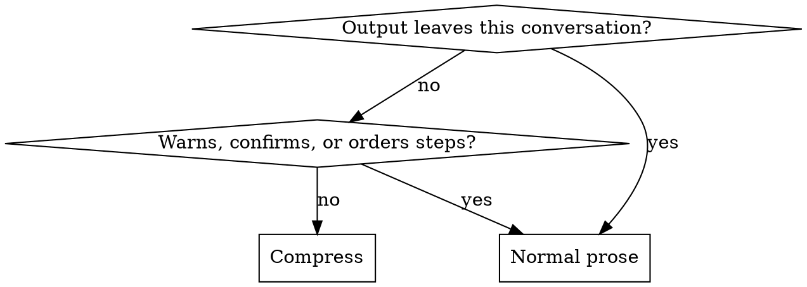

# Crouton

## Overview

A crouton is the same bread with the water driven off — smaller, drier, and it keeps. That is the whole operation: remove what evaporates, keep what was structural. The hard part is never being shorter. It is knowing which words were water.

And before that, knowing that words were never where most of the water was. Asked to use fewer tokens, almost everyone tightens their prose, because prose is the part they can see themselves writing. In a measured agent session it is a rounding error. What costs is what gets pulled *in*.

Two failures sit on either side of this, and the second is the expensive one. Padding costs the reader time. Cutting a negation, a unit, or an "unverified" costs them a wrong decision, and nothing in the shorter text tells them to check.

## When to use

- The user asks for brevity, terseness, "caveman mode", fewer tokens, or less context burn.
- A long session where remaining context is the binding constraint.
- Replies have drifted into preamble, tool narration, and closing summaries.
- Output goes to someone watching the work live, who can ask a follow-up cheaply.
- Any run long enough to read more than a couple of files, whether or not anyone asked for brevity.
- **Not for:** a written explanation aimed at one reader with one pending question → `explaining-technical-work`, which settles *what* to say before this settles how tightly to say it. Marking claims verified, inferred, or assumed → `calibrating-confidence`, which this never overrides. Anything written to last → `writing-durable-docs`, `writing-commit-messages`, `writing-release-notes`.

## Where the tokens actually are

Every turn re-sends the whole conversation. So anything pulled into context is not paid for once — it is paid for again on every turn that follows it, which is what makes the ordering below so lopsided.

| Spend | Roughly what it costs | Cut by |
|---|---|---|
| The per-request floor — system prompt, tool schemas, skill list | The largest single number, and mostly fixed. In one measured harness a run that made no tool calls at all still cost tens of thousands of tokens | You cannot compress it. You can decline to *add* to it — see the tool row under false economies |
| Content pulled into context — files, logs, command output, diffs | **About three times its own size**, because of the re-sending. A 1,300-line file is not a 13k-token read; it is a 30k-token decision | The read rules below |
| Tool calls themselves | Low thousands each, before whatever they return | Name what the result would change before firing; if nothing, skip it |
| Repeated context — re-pasting background, restating the task, re-quoting a diff | Grows with session length | Say it once, refer back |
| Your own prose | Tens of tokens per reply. Low single-digit percent of a session | The registers below |

Those magnitudes came from measuring one harness and one model family, so treat the exact numbers as illustrative and the **ordering** as the finding — it follows from re-sending, which every turn-based agent does.

The practical consequence is blunt: a session that shaves every article while reading a 2,000-line file it already had has compressed nothing. It has changed its accent. Fix the reads first; prose is the last row of that table, not the first.

## The read rules

Checkable, in the order they pay. Assume you are starting from the expensive default: across a sample of real agent sessions, **95% of file reads pulled the whole file** — no range, no offset — so this is not a list of edge cases to watch for. It is a list of the normal thing, priced.

- **Never read what you already have.** A file read at turn 3 is still in context at turn 30. In that same sample this went wrong in 44% of sessions, so it is worth an explicit check rather than trust — though some harnesses now refuse the repeat for you, which is worth knowing before you build anything to enforce it. Re-reading it does not refresh anything; it buys a second copy at full price. This includes re-reading a file you just edited to confirm the edit — the edit already reported success or failed loudly.
- **Locate, then read the range.** `grep -n` for the symbol, then `sed -n '120,180p'`. Reaching for the whole file is a decision to pay for the other 90% of it, three times over.
- **Outline before opening.** For anything over a couple of hundred lines, `grep -n '^\(def\|class\|func\|function\|type\) '` costs a few hundred tokens and usually answers the question, or tells you exactly which range to pull.
- **Cap what a command can return.** `| head -50`, `--stat` before a full diff, `-q` on a test runner, `| tail` on a log. An unbounded command is an unbounded read with a different name.
- **Do not re-run a command whose output cannot have changed.** Two identical test runs with no edit between them cost twice and prove once.
- **Search rather than enumerate.** Reading ten files to find which one defines something costs ten files; one `grep -rn` costs one result set.

None of this trades away correctness. Every one of them returns the same information for less, which is the only kind of compression this skill is actually about.

## What survives at any length

- **Negations** — not, no, never, only, except, unless. Dropping one inverts the claim, and no length target buys that back.
- **Numbers, units, versions, identifiers.** "340ms at p99" survives; "fast" is not a compression of it. Paths, symbols, flags, and quoted errors stay byte-exact — never paraphrased, never elided to "…".
- **Code, commands, and diffs**, unchanged. Compress around them.
- **Epistemic markers.** "Hedging" is two different things sharing one word. *Filler* — "I think maybe it might possibly be" — is water. *Load-bearing uncertainty* — unverified, assumed, didn't check the rollback path — is the finding. Compress its form to a single word; never compress it to zero. A confident-sounding short answer costs more than a long one, because it gets acted on.
- **The consequence of anything irreversible**, in full.
- **Order, wherever order is the content.** "Migrate table drop column backup first" — back up before dropping, or drop and then back up what survived? The fragments do not say, and one of those readings destroys data.

## False economies

Tokenizers encode common words cheaply *because* they are common, and coinages expensively for the same reason. So most of what *looks* like compression carries no real saving, and none of it is free:

| Move | Why it doesn't pay |
|---|---|
| Adding a tool, plugin, hook, or MCP server to save tokens | Its schema joins the per-request floor and is re-sent every turn, so it is charged whether or not it is used. To break even it has to save more than it costs on every run, and the bounded-read tools most such servers offer — ranged read, grep, glob — are usually already in the harness. **Check what the harness already does before building it**: one agent harness declines a repeated identical read of an unchanged file on its own, so a hook written to catch exactly that was pure overhead on every read it did not fire on. Measure the schema, and the thing it duplicates, before adding one |
| Invented abbreviations — `cfg`, `impl`, `req`, `fn`, `auth` | A coinage is unfamiliar to the tokenizer and to the reader, so you pay in decoding and save nothing worth counting. Established acronyms (API, DB, HTTP, TLS) are fine — in this domain they are ordinary words |
| Symbol substitution — `→`, `&`, `w/`, `b/c` | Not free, and it replaces a word that was already cheap. Nothing saved, ambiguity added |
| Mangled grammar — "when it not", "see" for "sees" | No shorter, sometimes worse: stripping an inflection can split a word that was whole. Broken grammar is a costume, not a compression |
| Dropped vowels, dropped spaces, `u` for `you` | Novel strings tokenize worse than the words they replace |
| Emoji, box-drawing, decorative tables | Among the most expensive characters per unit of meaning available |
| A compressed answer plus a normal-prose recap | Pays for both. The most common way this mode ends up costing more than not using it |

The rule under all seven: **if the compressed thing is not actually cheaper, use the plain one.** And never add a word to sound terse — inserting a pronoun or a copula to fake broken grammar is growth wearing compression's clothes.

## Registers

This is the smallest row of the table. Pick by who reads it and what they do next, not by how compressed it feels like being.

| Register | Shape | Fits |
|---|---|---|
| **Trimmed** | Full grammar; preamble, filler, and closing summaries gone | Default. Anything read once and carefully, or quoted later |
| **Clipped** | Fragments and dropped articles, but the facts still joined into sentences | Live back-and-forth with someone watching the work and able to ask |
| **Telegraphic** | One line per fact, nothing joining them — a list, not a paragraph | Status during a long run; findings the reader will scan and pick from |

Floor for all three: a reader who must ask a follow-up to disambiguate was charged more than the compression saved, and a follow-up costs a whole extra turn — which is the entire conversation re-sent. Two follow-ups on one answer means the register was a step too tight.

Start at Trimmed. Move further toward it unprompted as the content gets harder or the stakes rise; move the other way only when asked.

One finding, three registers:

- **Trimmed** — "The retry loop has no backoff, so a slow upstream turns into a thundering herd. One-line fix in `client.go:88`."
- **Clipped** — "Retry loop has no backoff. Slow upstream becomes thundering herd. One-line fix, `client.go:88`."
- **Telegraphic** — three lines, one fact each: "Retry loop: no backoff." / "Slow upstream becomes a thundering herd." / "Fix: `client.go:88`."

Note how little the last step buys. Below Trimmed the savings are words, not turns, which is why the register is chosen for what the reader can take in at a glance rather than for the count.

## Where compression stops

**Leaves the conversation** means read by someone who was not here: commit messages, code and comments, docs, ADRs, issue and PR and ticket bodies, release notes, postmortems, memory files, messages to third parties, and any file written to disk. None of those readers can ask what you meant. Compress the conversation; never the artifact.

Inside the conversation, drop back to prose for a warning before something destructive or irreversible, a security caveat, a confirmation being asked for, a sequence whose order fragments would blur, and the turn right after someone says they didn't follow. Resume immediately after.

The read rules have no such exception. Reading a range rather than a whole file changes nothing about what the artifact says, so it applies while writing a commit message exactly as it does mid-run.

## Holding the mode

- It is session state, not a per-reply style. Finishing the task doesn't end it; neither does an error, a tool detour, or a change of subject. Only the user ends it, by asking — and the reply after that is ordinary prose, with no announcement of the switch back either.
- Drift is the normal failure and it is gradual: filler returns first, then preamble, then narration. The reads drift first of all and least visibly, because nothing in a re-read looks like a mistake. Re-check both where anything else would be re-checked — after a long tool sequence, after a mistake, after a context summary.
- **Never announce it.** No mode banner, no third-person tag, no explaining the register. Someone asking for less output does not want a sentence about how little output there will be. Exception: they ask what mode is on.
- **No tool narration.** Fire the call. No preface, no recap, no statement of what comes next. Text before a call earns its place only to warn, to resolve an ambiguity, or to ask something that changes the call.
- One answer. Not a compressed one and then a readable one.

## Compressing in another language

- Reply in the language the user writes in — every line, including status lines, not just the final answer. Compress the register, not the language.
- "Drop articles" is advice for languages that have articles. Where small words carry case or role — Japanese and Korean particles, Turkish and Finnish suffixes, Hindi postpositions — they are grammar, and dropping them changes who did what to whom.
- Leave the politeness level the user set. In several languages that level is social information rather than filler; cut set phrases and repetition instead.
- Technical terms, code, API names, CLI flags, commit-type keywords, and exact error strings stay verbatim in every language, unless a translation was asked for.

## Checking that it worked

- Count something on one real before/after pair — words, characters, lines, tokens — before believing a change did anything. Unmeasured compression is a claim about tone.
- **Know the noise before believing the number.** Two runs of the same agent on the same task differ by a lot on their own — in one measured harness the median gap between replicates was a few percent and the worst was over twenty, because one run decides to double-check something and the other doesn't. A change that moves the total by less than that gap has not been shown to do anything. Hold the task identical and vary one thing if you want a number you can trust.
- **A saving on one model is not a saving on every model.** The same guidance measured 10% cheaper under one model and indistinguishable from nothing under a stronger one that was already reading in ranges without being told. Measure on the model you actually run; a number from another tier is a hypothesis, not a result.
- Don't quote a percentage nothing counted. Per `calibrating-confidence`, "shorter" is honest and a fabricated 60% is not.
- Two ways an answer gets shorter without saving anything: it dropped a caveat, or it moved the work into the reader's next question.

## Common mistakes

| Symptom | Real cause |
|---|---|
| Session token use barely moves | Prose trimmed; the reads were never examined. This is the default failure, not an edge case |
| The same file appears in context three times | Re-read instead of scrolled back to; paid for at full price each time |
| A 40-line answer required reading 2,000 lines | No outline pass — the whole file was opened to find one function |
| A tool was added to save context and the session got more expensive | Its schema is charged every turn whether or not it is used |
| Nearly every reply draws a clarifying question | Register a step too tight; the saving moved to the reader's turn, and a turn costs more than the words did |
| A terse answer followed by a prose summary of it | Both halves paid for; net cost above doing nothing |
| Output reads as broken English and is the same length | Grammar mangled as costume; none of it tokenizes shorter |
| A commit message or PR body reads like chat | Mode applied to an artifact; the gate skipped |
| A confident one-liner turns out to have been a guess | An uncertainty marker cut along with the filler it resembled |
| Mode quietly gone by turn 30 | Treated as a reply style rather than as session state |
| "Dropped the old rows" — and there was no backup | The warning compressed with everything else |
| A measured 4% improvement reported as a win | Smaller than the run-to-run noise; nothing was shown |
| Terse in English, verbose in the user's own language | Register applied to the reply, not to every line |

## Red flags

- "I'll be more concise" — said about a session whose cost is reads.
- "Let me re-read that file to make sure."
- "I'll just look at the whole file, it's easier."
- "I'll add a short normal-prose summary so it's clear."
- Naming or announcing the mode inside an answer.
- Abbreviating a word that was already one token.
- Cutting a hedge without checking whether it marked something unverified.
- Reaching for the tightest register on the hardest question.
- Writing a commit message in the conversation's register.
- Quoting a savings percentage nothing measured, or one smaller than the noise.
- "Task's done, so the mode's done."
