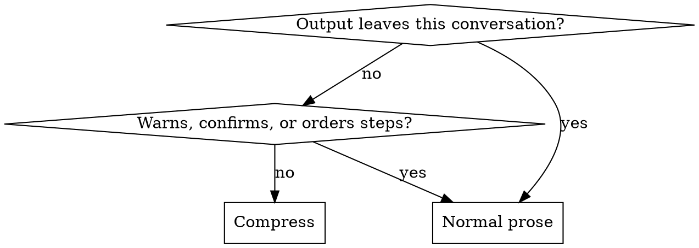

# Crouton

## Overview

A crouton is the same bread with the water driven off — smaller, drier, and it keeps. That is the whole operation: remove what evaporates, keep what was structural. The hard part is never being shorter. It is knowing which words were water.

Two failures sit on either side of that, and the second is the expensive one. Padding costs the reader time. Cutting a negation, a unit, or an "unverified" costs them a wrong decision, and nothing in the shorter text tells them to check.

## When to use

- The user asks for brevity, terseness, "caveman mode", fewer tokens, or less context burn.
- A long session where remaining context is the binding constraint.
- Replies have drifted into preamble, tool narration, and closing summaries.
- Output goes to someone watching the work live, who can ask a follow-up cheaply.
- **Not for:** a written explanation aimed at one reader with one pending question → `explaining-technical-work`, which settles *what* to say before this settles how tightly to say it. Marking claims verified, inferred, or assumed → `calibrating-confidence`, which this never overrides. Anything written to last → `writing-durable-docs`, `writing-commit-messages`, `writing-release-notes`.

## Cut in yield order

Reply prose is the only spend anyone notices, and the smallest one on the list.

| Spend | What it costs | Cut by |
|---|---|---|
| Files, logs, and command output pulled into context | Hundreds to thousands of tokens per call — and each one is re-sent with every later turn | Read the range, not the file; `grep` and `sed -n` over `cat`; no re-read to confirm an edit that already reported success |
| Tool calls fired on a guess | Same size, no yield | Name what the result would change before firing; if nothing, skip it |
| Repeated context — re-pasting background, restating the task, re-quoting a diff | Grows with session length | Say it once, refer back |
| Your own prose | Tens of tokens per reply | The rest of this skill |

A session that shaves every article while re-reading a 2,000-line file for the third time has compressed nothing; it has changed its accent. Fix the reads first. Prose is the last item on that list, not the first.

## What survives at any length

- **Negations** — not, no, never, only, except, unless. Dropping one inverts the claim, and no length target buys that back.
- **Numbers, units, versions, identifiers.** "340ms at p99" survives; "fast" is not a compression of it. Paths, symbols, flags, and quoted errors stay byte-exact — never paraphrased, never elided to "…".
- **Code, commands, and diffs**, unchanged. Compress around them.
- **Epistemic markers.** "Hedging" is two different things sharing one word. *Filler* — "I think maybe it might possibly be" — is water. *Load-bearing uncertainty* — unverified, assumed, didn't check the rollback path — is the finding. Compress its form to a single word; never compress it to zero. A confident-sounding short answer costs more than a long one, because it gets acted on.
- **The consequence of anything irreversible**, in full.
- **Order, wherever order is the content.** "Migrate table drop column backup first" — back up before dropping, or drop and then back up what survived? The fragments do not say, and one of those readings destroys data.

## False economies

Tokenizers encode common words cheaply *because* they are common, and coinages expensively for the same reason. So most of what *looks* like compression carries no real saving, and none of it is free:

| Move | Why it doesn't pay |
|---|---|
| Invented abbreviations — `cfg`, `impl`, `req`, `fn`, `auth` | A coinage is unfamiliar to the tokenizer and to the reader, so you pay in decoding and save nothing worth counting. Established acronyms (API, DB, HTTP, TLS) are fine — in this domain they are ordinary words |
| Symbol substitution — `→`, `&`, `w/`, `b/c` | Not free, and it replaces a word that was already cheap. Nothing saved, ambiguity added |
| Mangled grammar — "when it not", "see" for "sees" | No shorter, sometimes worse: stripping an inflection can split a word that was whole. Broken grammar is a costume, not a compression |
| Dropped vowels, dropped spaces, `u` for `you` | Novel strings tokenize worse than the words they replace |
| Emoji, box-drawing, decorative tables | Among the most expensive characters per unit of meaning available |
| A compressed answer plus a normal-prose recap | Pays for both. The most common way this mode ends up costing more than not using it |

The rule under all six: **if the compressed phrasing is not actually shorter, use the plain one.** And never add a word to sound terse — inserting a pronoun or a copula to fake broken grammar is growth wearing compression's clothes.

## Registers

Pick by who reads it and what they do next, not by how compressed it feels like being.

| Register | Shape | Fits |
|---|---|---|
| **Trimmed** | Full grammar; preamble, filler, and closing summaries gone | Default. Anything read once and carefully, or quoted later |
| **Clipped** | Fragments and dropped articles, but the facts still joined into sentences | Live back-and-forth with someone watching the work and able to ask |
| **Telegraphic** | One line per fact, nothing joining them — a list, not a paragraph | Status during a long run; findings the reader will scan and pick from |

Floor for all three: a reader who must ask a follow-up to disambiguate was charged more than the compression saved. Two follow-ups on one answer means the register was a step too tight.

Start at Trimmed. Move further toward it unprompted as the content gets harder or the stakes rise; move the other way only when asked.

One finding, three registers:

- **Trimmed** — "The retry loop has no backoff, so a slow upstream turns into a thundering herd. One-line fix in `client.go:88`."
- **Clipped** — "Retry loop has no backoff. Slow upstream becomes thundering herd. One-line fix, `client.go:88`."
- **Telegraphic** — three lines, one fact each: "Retry loop: no backoff." / "Slow upstream becomes a thundering herd." / "Fix: `client.go:88`."

Note how little the last step buys. Below Trimmed the savings are words, not turns, which is why the register is chosen for what the reader can take in at a glance rather than for the count.

## Where compression stops

**Leaves the conversation** means read by someone who was not here: commit messages, code and comments, docs, ADRs, issue and PR and ticket bodies, release notes, postmortems, memory files, messages to third parties, and any file written to disk. None of those readers can ask what you meant. Compress the conversation; never the artifact.

Inside the conversation, drop back to prose for a warning before something destructive or irreversible, a security caveat, a confirmation being asked for, a sequence whose order fragments would blur, and the turn right after someone says they didn't follow. Resume immediately after.

## Holding the mode

- It is session state, not a per-reply style. Finishing the task doesn't end it; neither does an error, a tool detour, or a change of subject. Only the user ends it, by asking — and the reply after that is ordinary prose, with no announcement of the switch back either.
- Drift is the normal failure and it is gradual: filler returns first, then preamble, then narration. Re-check the register where anything else would be re-checked — after a long tool sequence, after a mistake, after a context summary.
- **Never announce it.** No mode banner, no third-person tag, no explaining the register. Someone asking for less output does not want a sentence about how little output there will be. Exception: they ask what mode is on.
- **No tool narration.** Fire the call. No preface, no recap, no statement of what comes next. Text before a call earns its place only to warn, to resolve an ambiguity, or to ask something that changes the call.
- One answer. Not a compressed one and then a readable one.

## Compressing in another language

- Reply in the language the user writes in — every line, including status lines, not just the final answer. Compress the register, not the language.
- "Drop articles" is advice for languages that have articles. Where small words carry case or role — Japanese and Korean particles, Turkish and Finnish suffixes, Hindi postpositions — they are grammar, and dropping them changes who did what to whom.
- Leave the politeness level the user set. In several languages that level is social information rather than filler; cut set phrases and repetition instead.
- Technical terms, code, API names, CLI flags, commit-type keywords, and exact error strings stay verbatim in every language, unless a translation was asked for.

## Checking that it worked

- Count something on one real before/after pair — words, characters, lines — before believing a register change did anything. Unmeasured compression is a claim about tone.
- Don't quote a percentage nothing counted. Per `calibrating-confidence`, "shorter" is honest and a fabricated 60% is not.
- Two ways an answer gets shorter without saving anything: it dropped a caveat, or it moved the work into the reader's next question.

## Common mistakes

| Symptom | Real cause |
|---|---|
| Nearly every reply draws a clarifying question | Register a step too tight; the saving moved to the reader's turn |
| A terse answer followed by a prose summary of it | Both halves paid for; net cost above doing nothing |
| Output reads as broken English and is the same length | Grammar mangled as costume; none of it tokenizes shorter |
| A commit message or PR body reads like chat | Mode applied to an artifact; the gate skipped |
| A confident one-liner turns out to have been a guess | An uncertainty marker cut along with the filler it resembled |
| Mode quietly gone by turn 30 | Treated as a reply style rather than as session state |
| "Dropped the old rows" — and there was no backup | The warning compressed with everything else |
| Session token use barely moves | Prose trimmed; file reads and re-reads never examined |
| Terse in English, verbose in the user's own language | Register applied to the reply, not to every line |

## Red flags

- "I'll add a short normal-prose summary so it's clear."
- Naming or announcing the mode inside an answer.
- Abbreviating a word that was already one token.
- Cutting a hedge without checking whether it marked something unverified.
- Reaching for the tightest register on the hardest question.
- Writing a commit message in the conversation's register.
- Quoting a savings percentage nothing measured.
- "Task's done, so the mode's done."
