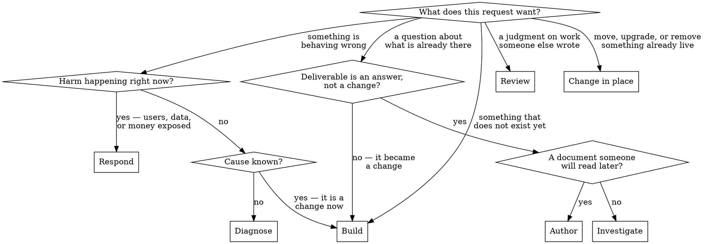

# Orchestrating work end to end

## Overview

A library of skills is not a method. Each one is sharp about its own stretch of the work and silent about what comes before and after it, which is why an agent holding all of them can still run a build in the wrong order: implementing before anyone agreed what to build, reviewing a diff against criteria nobody wrote down, calling it done because the last thing tried finally worked. Every individual step looks defensible. The run is still wrong.

This skill is the spine those skills hang off. It answers five questions continuously — which track this work is on, what envelope the run executes in, which phase it is in, what has to be true before the next phase starts, and where that is written down — and it treats the answers as gates rather than as suggestions. The failure it exists to prevent is not chaos. It is a plausible-looking run that skipped a gate nobody noticed was there.

Track and envelope are two axes, not one. The track says what shape the work is; the envelope says what the run may assume about the world it executes in — who answers a gate, how much run this is worth, what a wrong turn costs, who else is writing. The spine's gates are written for one setting of that second axis, and that setting is right often enough to be dangerous.

## When to use

- A request will take more than a single edit, and how much process it needs is still open.
- Several skills each cover one stretch of the work and nothing is putting them in order.
- Mid-flight, and which phase this is — or what would prove it finished — has gone fuzzy.
- The run has to survive compaction, a handoff, or a different session picking it up.
- A finding has just arrived that might belong to an earlier phase than the current one.
- Nobody will be there to answer a gate, or nobody has answered the last one.
- The change looks small enough that running the whole spine would itself be the defect.
- The conditions changed underneath a run that is already going.
- Not for: judging whether some specific skill applies to the response you are about to write. `using-tbaguette` owns that gate, it runs on every single turn, and it keeps running inside every phase of this one.
- Not for: a genuine one-liner with a known cause and a test that already covers it. Fix it, prove it, say so.

## Before the route: the library itself

Everything below this line gets decided by skills from one library, so the first question is not about the work. It is whether the copy of that library about to run the work is the published one. A whole spine executed against stale guidance is not a run with a version problem — it is a run orchestrated by decisions somebody already replaced, and nothing in the phase log will say so.

`keeping-tbaguette-current` owns the check, and usually it does not need running here. A harness that injects the library's start-of-session notice has already run it and attached the answer; read that answer rather than paying for the same network round trip twice. Where nothing is attached — a fresh harness, a session that began before the check existed, a run resumed from a transcript — run it now, before the track is named.

| Result | What the run does |
|---|---|
| Current | Nothing, and say nothing. Carry on to the route |
| Behind, updated cleanly | Record the new version on the run record's first line, then route — a skill changed underneath this run and that is worth being able to see later |
| Behind, could not update — local changes, no network, a conflict | Say so once, name what is stale, and route anyway |

That last row is the point: this gate reports, it does not block. A library that cannot be updated is worth knowing about and is not worth refusing to start a run over.

Then, immediately after it and still before the track is named,
`tending-tbaguette` runs. The two are one loop seen from both ends: the
currency check pulls the library's improvements *in*, and tending is what
pushes this run's improvements back *out*. It goes here rather than at
phase 8 because it has to be watching from the first turn — a correction
generalizes at the moment it lands, and a watcher started once the work is
finished has already missed everything worth catching.

| Its state | What the run does |
|---|---|
| Nothing queued | Nothing, and say nothing. It is now watching for the rest of the run |
| Candidates already queued | Contribute at the next natural lull — never mid-phase, and never without its own approval gate |
| A candidate lands mid-run | Two sentences into the queue file, then straight back into the open phase |

The third row of the table above and this one are the same fact seen twice.
A library that could not update because the install carries local changes is
a library with an uncontributed change sitting inside it, and
`tending-tbaguette` owns getting that change out of the working tree and
into a pull request — where the licence, and everyone else running these
skills, needs it to go.

## Route before you run

Say the track out loud before the first action, the way `scoping-before-building` requires the size to be said out loud — a track chosen silently is a track nobody can correct.



| Track | The request | Runs |
|---|---|---|
| **Build** | Something that does not exist yet, or behavior nobody has signed off on changing | The full spine below |
| **Diagnose** | Something is wrong and the cause is not known | Reproduce, locate, fix, pin — then rejoins Build at review |
| **Respond** | Something is broken *now*, with a clock and an audience | Declare, assess, preserve, mitigate, stabilize — then hands back to Diagnose |
| **Investigate** | A question, an audit, a feasibility check; the deliverable is an answer, not a diff | Orient, gather, conclude, report — no branch to land |
| **Review** | A judgment on work you did not write; the deliverable is findings someone else acts on | Orient, cover, judge, deliver — no branch of your own to land |
| **Author** | The deliverable is a document people will read long after this run | Frame the reader, gather, draft, verify, land |
| **Change in place** | An upgrade, a migration, a deletion, a live-system operation | Reversibility first, then the specific skill — then rejoins Build at prove |

Two rules govern the choice, both inherited from `scoping-before-building` because a track and a size are the same kind of judgment: **torn between two tracks, take the heavier one**, and **the classification only moves one way**. A Diagnose run that turns out to need a new subsystem becomes a Build run and picks up the design gate it skipped. Nothing downgrades mid-run, however trivial the remainder looks in hindsight.

## Then name the envelope

The track is only half the route. Every gate below is answered by someone, at some size, against something that can or cannot be undone, in a tree that may have another writer in it — and the spine is written for exactly one setting of those: a human replying within a turn or two, a change worth eight phases, a mistake that can be walked back, one writer. Each of those is load-bearing on a gate, none of them is stated, and a default that is usually right is a default nobody notices being wrong.

Read all five dials, say them out loud alongside the track, and put them on the run record's first line. [reference/envelopes.md](reference/envelopes.md) has how to read each one, what each changes, and which combinations carry a rule that no single dial carries alone.

| Dial | Values | Decides |
|---|---|---|
| **Presence** | paired · async · autonomous · unattended | Who answers a gate |
| **Amplitude** | express · standard · campaign | How much run the work is worth |
| **Blast radius** | sandbox · repo · live | What a wrong turn costs |
| **Crew** | solo · fanned · shared tree | Who else is writing to this tree |
| **Register** | trimmed · clipped · telegraphic | What the run spends reading it and saying it |

Four settings route somewhere specific, before the first action rather than after:

- `autonomous` or `unattended` → `bounding-autonomous-work`. Every gate that was a question becomes a written self-answer carrying a stop condition, and the door bound stands in every envelope.
- `express` → [reference/express.md](reference/express.md). Four beats rather than eight, behind entry conditions that get checked rather than hoped.
- `campaign` → `checkpointing-long-runs`. The record stops being scaffolding and becomes the run's only memory.
- any register → `crouton`. It binds what the run *pulls in*, not only what it writes: ranges rather than whole files, `grep` and `sed -n` over `cat`, no re-read to confirm an edit that already reported success, background said once and referred back to. Read here, because by phase 8 every read has already been paid for.

Amplitude obeys the same rule as the track and for the same reason: **it only ratchets up**. Express promotes to standard the instant an entry condition turns out false; standard promotes to campaign the instant the context holding the run gets close to full. Nothing demotes on your own judgment, because the judgment that says "this got smaller" is made by the part of the run that most wants to be finished.

### And set the register in the same breath

The track says which phases run and the envelope says who answers their gates. Neither says what the run **spends** getting there, and the spine's unstated default is the most expensive setting available: pull the whole file, narrate the call, restate the background, close each phase with a summary of what the reader just watched happen. A Build run charges that eight times, and every track reusing the spine charges it again.

Register is read *here*, beside the other four, rather than at phase 8 when the report is written and every read has already been paid for. `crouton`'s own ordering is the reason: prose is the smallest of the four spends it names, and the three above it — whole files pulled into context, tool calls fired on a guess, background re-pasted each phase — are the ones that multiply by phase count. Tightening the closing summary while re-reading the same file at every boundary changes the run's accent, not its cost.

Three things here sit outside it, per that skill's own gate, and shortening any of them is a defect rather than a saving: **the run record** — ledger, phase log, rulings — and **every artifact phase 8 lands**, because both are read by someone who was not here; and **any warning before something irreversible**, which the door bound already requires in full. Compress the run, never the record, and never the warning.

### A gate whose answerer is missing is substituted, not skipped

This is the single most common way an unsupervised run goes wrong, and it never looks like a shortcut at the time. A question gets asked, nothing answers it, and the run continues — having quietly settled the question itself, without recording that it did. Six hours of competent work then rest on an answer nobody chose.

`bounding-autonomous-work` owns the substitutions in full. The shape of all of them: the gate keeps its job and changes its mechanism. An approval becomes a written design carrying the approach that lost, a reversibility bound, and a stop condition that fires if it turns out wrong. A clarifying question becomes an answer taken from the code, or a ruling naming the reading that lost — never a fact. A second pair of eyes becomes `red-teaming-your-own-work` and `karen-and-the-manager` run as hard gates rather than as a courtesy.

One gate has no substitute in any envelope: **an irreversible action gets a human.** An autonomous run may prepare it completely and may not take it. Reaching that point is not the run failing — it is the run ending correctly, with one step left for someone who can own it.

## The build spine

Each phase names what lets you in, who owns it, and the evidence that opens the next gate. The evidence column is the point: a phase ends when something outside your own confidence says it did.

| # | Phase | Enter when | Owner skill | Gate — what opens the next phase |
|---|---|---|---|---|
| 1 | Frame | The request has arrived | `scoping-before-building`, `finishing-what-you-started` | Track and envelope said out loud; the acceptance ledger exists as a file, each line derived from the request's own words and watched failing once |
| 2 | Design | The work is understood well enough to propose a shape | `scoping-before-building` | An explicit yes from your human partner. Architectural work has a written spec; bounded work has a few sentences in chat. The gate itself never shrinks — with nobody there to say yes it is substituted, per `bounding-autonomous-work`, not skipped |
| 3 | Isolate | The design is approved | `isolating-work-with-worktrees` | Work is off the shared trunk, and the test suite was run once, before any change, so the baseline is measured rather than assumed |
| 4 | Plan | An approved design exists and the work is more than a couple of tasks | `structuring-an-implementation-plan` | Every task bite-sized, individually verifiable, no placeholders, `- [ ]` on each |
| 5 | Implement | A plan exists, or the change is small enough not to need one | `delegating-tasks-with-review-gates`, `working-a-plan-task-by-task`, `fanning-out-independent-work` | Every task closed with its own verification actually run — `writing-the-failing-test-first` governs the order inside each task |
| 6 | Review | Every task is closed | `handing-off-for-review`, `reviewing-code-deeply`, `verifying-review-feedback` | Every finding fixed, refuted with a reason, or parked with a ruling. None dropped in silence |
| 7 | Prove | The tree is believed finished | `confirming-before-claiming-done`, `finishing-what-you-started` | Every acceptance line carries evidence measured *now*, not recalled. Surrendered lines are marked surrendered, not deleted. Findings parked at phase 6 are triaged here, not inherited in silence |
| 8 | Land | The proof holds | `landing-a-finished-branch`, `atomic-commits`, `writing-commit-messages`, `offering-the-next-move` | The branch is where it belongs, the workspace is cleaned up, anything left undone is named to whoever owns it next, and the run closes by offering the next move as a choice rather than describing it in a paragraph |

Phases 6 and 7 are separate on purpose, and collapsing them is the most common way a run ends badly. Review asks whether the work is any good. Prove asks whether the thing that was actually asked for is actually there. A clean review of the wrong deliverable passes phase 6 every time.

The other tracks reuse this spine rather than replacing it:

- **Diagnose** keeps phases 1 and 3 — a bug still gets a ledger and still gets off the trunk — and runs reproduce → locate → fix → pin in place of phases 2, 4, and 5, under `diagnosing-before-fixing`. It rejoins at phase 6. Its gate before any fix is a reproduction that fails on demand; its gate after is a regression test that failed before the fix and passes after (`regression-test-from-bug`).
- **Respond** is the one track that does not open with a ledger — there is no request to derive one from. Its equivalent is the **impact statement**: who is affected, how badly, and whether it is growing, written in user terms, and the first gate is that the harm stopped rather than that it is understood. `responding-to-incidents` owns declare → assess → preserve → mitigate → stabilize, and inverts the usual order deliberately: mitigate before you diagnose. The moment users are safe it hands back to **Diagnose**, which picks up the spine normally. Its close-out is `writing-postmortems`, and skipping that because the cause turned out obvious in hindsight is how the same incident returns next quarter.
- **Investigate** runs orient → gather → conclude → report. It reaches phase 8 only if it produced an artifact that has to land — a doc, an ADR, a spec. Its close-out gate is `calibrating-confidence`: every claim in the report marked verified, inferred, or assumed, with the unknowns named rather than smoothed over.
- **Review** runs orient → cover → judge → deliver, under `handing-off-for-review` and `reviewing-code-deeply`. Its gate is **coverage of the diff**, not confidence in a conclusion: every changed file actually seen, and what is *absent* from the change weighed alongside what is in it. It ends at delivery rather than at landing, because the branch belongs to whoever wrote it, and `verifying-review-feedback` governs the return leg when the findings come back argued.
- **Author** runs frame the reader → gather → draft → verify → land. The phase that gets skipped is verify, every time: a document's claims are checked against the thing they describe, the same way code's are, rather than against the memory of it. `writing-durable-docs` decides what will still be true in a year, `explaining-technical-work` sets the altitude, and the specific form — `writing-adrs`, `writing-release-notes`, `writing-postmortems` — owns the shape.
- **Change in place** opens with `deciding-reversibility` — a one-way door is a different piece of work from a two-way one — then runs its own skill from the routing reference, and rejoins at phase 6. An upgrade or a migration is reviewed like any other diff; arriving with no new code of its own is not a reason to skip the seat.

### When there is no repository

Phases 3 and 8 name git — a worktree to isolate in, a branch to land. Plenty of real work has
neither: operations against a live system, reverse engineering, data analysis, research, an incident
on infrastructure nobody version-controls. The phases still apply. Only their instruments change.

**Isolate** means *the change cannot reach the thing you would be sorry to break*, and a worktree is
one implementation of that. Off-repo it is a copy, a snapshot, a scratch database, a staging host, an
exported archive — whatever makes the original recoverable. The other half of that gate travels
unchanged, and is the half more often dropped: **measure the baseline before touching anything.**
Where there is no suite, the baseline is whatever measurement the change is meant to move. Without
one, "it is better now" has nothing to be better than.

**Land** means *the artifact reached its durable home and the next person can find it* — the report
filed where someone will look, the configuration in the place that survives a rebuild, the finding
written into the record rather than left in a transcript that scrolls. The cleanup half is
unchanged too: the scratch copy removed or deliberately kept, and anything unfinished named to
whoever owns it next.

The failure this exists to prevent is the plausible one. A run reads two phases it cannot enter,
concludes the spine is for somebody else's kind of work, and abandons the track entirely — rather
than entering those phases and skipping them with a logged reason, which is what the phase log is
for. **A phase with no counterpart is skipped and recorded. It is never a reason to drop the
track.**

## The floor: what survives every envelope

Six things do not scale down. Not with amplitude, not with presence, not with how obviously correct the work is. An envelope that cannot afford one of these owes a cheaper mechanism for it, never a shrug — the same way a sixteen-color terminal still owes the contrast guarantee.

- **The track and the envelope are said out loud before the first action**, and both land on the record. A route chosen silently is a route nobody can correct.
- **Something outside your own confidence closes the run.** A person, or a command whose output you read. Re-reading the diff is not proof of anything except that you read it.
- **What would prove this done is written down before the work**, in the request's own words, and backed by a check that was watched failing once. Express gets one line; a campaign gets many; Respond writes an impact statement instead, because there is no request to quote. Zero is not an amplitude.
- **A one-way door gets a human.** No envelope, no confidence level, and no deadline converts this into a self-answer.
- **What was not done is named** to whoever owns it next. Silence is not a report, and it reads as completeness to everyone who was not there.
- **The record is written when the thing happens.** A record assembled at the end was written by whatever survived, which is exactly the memory it existed to guard against.

## Pull in the specialists

The spine names one owner per phase. It is not the only skill that phase needs, and treating it as the whole answer is how a library this size gets used like a library of eight.

At each phase boundary, check what the *content* of this work calls for, not just its stage: an API in the design phase pulls `designing-apis` and `drawing-boundaries`; anything parsing input someone else controls pulls `handling-untrusted-input` and `threat-modeling` before implementation rather than after review; a slow endpoint pulls `performance-profiling` before anyone optimizes anything. [reference/phase-routing.md](reference/phase-routing.md) indexes every skill in the library against the phase where it earns its place, so the check is a lookup rather than a memory exercise. Consult the phase you are entering, not the whole file.

Two of those pulls are load-bearing enough to name here. Before phase 1 on any inherited or unfamiliar work, `recovering-agent-context` and `orienting-in-unfamiliar-code` come first — a run framed against a codebase you have not looked at frames the wrong thing. And after phase 7 believes it is finished, `red-teaming-your-own-work` and then `karen-and-the-manager` are this library's standard adversarial close, most warranted exactly when the ordinary review came back clean.

## One run record, from frame to land

Conversation memory does not survive compaction; a file does. Keep one record for the whole run, in the same file the acceptance ledger already lives in — `finishing-what-you-started` owns that ledger's contents and its `LEDGER.md` default, and a second file competing with it is two accounts of progress that will disagree by phase 5.

Add four things to it that the acceptance ledger alone does not carry:

```
Track: build | diagnose | respond | investigate | review | author | change-in-place
Envelope: presence=paired | amplitude=standard | radius=repo | crew=solo
Phase: <name> — entered <when>, gate: <what will prove it>

## Phase log            (append only; never rewrite a line)
- frame: complete — 6 acceptance lines, all watched failing
- design: complete — approved in chat 14:20; spec at docs/specs/foo.md
- isolate: skipped — already on a feature branch, baseline green (48/48)
- plan: complete — docs/plans/foo.md, 7 tasks
- implement: task 3/7 complete (a1b2c3d..d4e5f6a, review clean)

## Rulings             (every decision that could be questioned later)
- task 2: reviewer flagged the retry cap as magic; plan mandates 5 — plan governs, recorded

## Stop conditions     (autonomous and unattended runs; written before the work)
- budget: three failed attempts at one green test
- surprise: anything outside src/api/ or its tests
- door: any push, deploy, or write to real data
- drift: any edit to an acceptance line
```

Four rules make it worth keeping. **Append, never rewrite** — a rewritten log is a log that agrees with whatever you now believe. **Every skipped phase gets a line saying why**, because that is what makes a skip a decision instead of an omission. **Every ruling gets a line**, because a finding dropped with nothing written down resurfaces later with no memory of why it was let go. And **every envelope change gets a line**, because a run whose conditions moved silently is running a process nobody chose.

After a compaction, the record and `git log` outrank your own recollection, and it is not close. A controller that trusts its memory re-dispatches work that is already committed — the single most expensive mistake this loop can make, and the one it is most confident about while making it. `checkpointing-long-runs` owns what goes into the record, when, and in what order of value; its headline is that the cheap half gets written and the expensive half — the dead ends — gets lost.

## The artifacts that outlive the run

The run record is scaffolding. A run also produces things meant to be read long
after the branch is gone, and the two get confused in one specific direction:
the durable artifact is maintained like scaffolding — written once, never
revisited — while the scaffolding is kept like an artifact, sitting in the repo
for a year because nobody decided it was finished.

| Artifact | Written at | Lifespan | Owner skill |
|---|---|---|---|
| Spec — what is being built and why this shape | Phase 2, before the yes | Outlives the branch | `scoping-before-building` writes it, `writing-durable-docs` decides what keeps |
| Plan — the tasks, in order | Phase 4 | Dies when its last box is ticked | `structuring-an-implementation-plan` |
| ADR — one decision, its forces, and what would reopen it | Whenever a decision gets made that a later reader will have to re-judge | Longest-lived thing here | `writing-adrs` |
| Run record / ledger | Phase 1, appended throughout | Dies with the run | `finishing-what-you-started` |

Three rules, and each exists because its absence has a recognisable symptom.

**One location, stated once.** "Where is the spec for X" must have an answer that
does not depend on who wrote it. Pick whichever directory the repository already
uses and put it there; the failure worth checking for first is a repository that
uses two, since design documents split across a served directory and an internal
one accumulate by whichever the author happened to know about, and the honest
answer to the question becomes "look in both". A phase-log line naming the path
is what makes the artifact findable from the run that produced it; a spec nobody
can locate was written for nobody.

**The artifact changes when the decision does.** Routing backward to phase 2
means the spec is now describing an approach that lost, and leaving it is worse
than never having written it: the next reader gets a confident description of the
wrong design, with no marker saying so. Update it in the same move that reopens
the phase, and say what changed rather than silently overwriting — the rejected
approach and the reason it was rejected are the parts `writing-adrs` says a future
reader most needs, and the parts most often deleted as obsolete.

**Decide what happens to the scaffolding at phase 8.** The plan and the run record
have done their job the moment the work lands. Deliberately delete them, or
deliberately keep them and say why; what is not allowed is leaving them because
nobody looked. A repository accumulating half-ticked plans from finished work is
one where nobody can tell an abandoned run from a completed one, which is exactly
the question `recovering-agent-context` will be asking six months from now.

Whichever way that goes, one thing precedes it. The record's surrendered lines and
its rulings are what `offering-the-next-move` harvests the run's closing choice from,
so the offer gets assembled while the record still exists. Tear it down first and
that choice is reconstructed from memory, which reliably yields the obvious next
step and nothing that was actually learned.

## Resume before you restart

Work arriving mid-flight gets the record read before anything else happens: the ledger file, the plan's checkboxes, `git log` on the branch. `recovering-agent-context` covers the wider sweep — other sessions, other agents, other tools that touched this repo and paid for dead ends you would otherwise pay for again.

Resuming means entering at the first phase whose gate is not yet met, not at the first phase. A run whose plan is written and whose tasks 1-3 are committed resumes at task 4, not at design. And a phase log whose last line is a task mid-fix-loop resumes inside that loop, not at the top of the task.

Resume the envelope too, and do not inherit it. The dials that were true when the record was written may not be true now — the human who was answering has gone, the tree has acquired a second writer, the small change is now a campaign. Re-read all four before entering the phase, the same way the track gets re-read.

## When a gate fails, route backward

A failed gate is information about which phase was wrong, and it is almost never the one currently open.

| What the failure says | Where it goes back to |
|---|---|
| A task cannot be implemented as written | Phase 4 — the plan, not the implementer |
| Review finds the approach wrong, not the code | Phase 2 — the design, the yes it was given under, and the spec that still describes the approach that lost |
| Proof finds an acceptance line nothing satisfies | Phase 4 or 5, depending on whether the plan omitted it or the work did |
| A finding indicts an already-closed task | The task that owns it, surfaced by name, with what has been built on top of it since |
| The request itself changed | Phase 1, and the ledger changes visibly rather than quietly |

Pushing forward through a failed gate is the failure mode this whole skill exists against. It always looks cheaper in the moment, because the cost lands on whichever phase is unlucky enough to be open when the problem finally becomes undeniable.

## When the envelope changes mid-run

The track rarely moves. The envelope moves constantly, usually without anyone noticing, and every one of these is a decision that belongs on the record.

| What you notice | The dial that moved | What the run does |
|---|---|---|
| The replies have stopped | presence: paired → async | Batch the open questions into one message; continue on everything that does not depend on the answers, park what does |
| You are about to answer your own question | presence: async → autonomous | Stop here. `bounding-autonomous-work` first — the substitutions and the stop conditions get written now, not at the end |
| The small change reached a second subsystem | amplitude: express → standard | Pick up the gates express skipped, design gate first |
| The context is filling and the work is not close to done | amplitude: standard → campaign | Write the record now, while the memory writing it is still good |
| The next command pushes, deploys, sends, or writes real data | radius: → live | Re-read reversibility before that command, not after it |
| The diff shows files you never opened | crew: solo → shared tree | Nothing destructive, nothing stashed, nothing reset. Stage by hunk and re-read before writing |
| Users started being affected while you investigated | track: diagnose → respond | The only upward track move that is urgent rather than procedural. Declare it out loud, then `responding-to-incidents` |

## Commands

Invoked directly, this skill takes a verb. With none, it runs as the spine: route, name the envelope, and enter at the first phase whose gate is not yet met.

| Command | Does |
|---|---|
| `route [request]` | Name the track and the four dials, and stop there. Useful before committing to a run, and as a second opinion on one already going |
| `resume` | Read the record, the plan's boxes, and `git log`, then enter at the first gate not yet met — never at the first phase |
| `gate` | Name the evidence that would open the phase currently blocking, and say plainly whether it exists yet |
| `record` | Write or refresh the run record — track, envelope, phase log, rulings, stop conditions — from what is actually on disk rather than from memory |
| `handoff` | Produce the brief a successor needs to take the next action without reading the run, per `checkpointing-long-runs` |
| `abort` | Stop cleanly: tree recoverable, record current, and a report naming what fired, what was done, and what remains |

## What this skill does not decide

It sequences; it does not overrule. The owner skill for a phase governs how that phase runs, and where the two appear to disagree, the owner wins — this file is a map, not a second opinion about territory it does not cover.

Two boundaries in particular. `using-tbaguette` still governs every individual turn, including turns inside a phase this skill opened. And nothing here licenses skipping the approval gate at phase 2: an orchestrated run that never got a yes is a faster way to build the wrong thing, not a substitute for asking.

Your human partner can move the track or the envelope in either direction, including down — they own the scope, and "just make the edit, skip the ceremony" is an instruction, not a rationalization to argue with. You cannot. A downgrade you chose yourself is the doubt talking; a downgrade they asked for is a decision, and it goes in the record as one, named and attributed, so the run still says what process it actually ran.

## Refuse

Category defaults, not bans. Any of these can be right in a specific run — but reaching for one when the axis was free means you were performing process rather than routing.

- A plan document for a change with two tasks.
- A clarifying question you could have answered by reading one file. `paired` makes questions cheap, not free.
- An acceptance line that restates the request instead of naming what would prove it.
- A worktree for a run that was never going to leave the branch it is already on.
- A subagent fan-out for work that is two edits in one file.
- A design gate performed at a partner who already said "just do it" — they moved the amplitude down, and re-asking is not rigor.
- A phase log written at the end, from memory, in one pass.
- A track named after the first three edits, describing what already happened.
- Narrating the phases to a reader who wanted the finding.
- Ceremony offered as evidence. "I ran the full spine" is not a claim about the work.

## Common mistakes

| Symptom | Real cause |
|---|---|
| A perfect implementation of something nobody asked for | Phase 2 approved a design the ledger at phase 1 was never checked against |
| The run is "basically done" for three more hours | Phases 6 and 7 collapsed into each other; the review passed, so the proof was assumed |
| A second session redoes committed work | No run record, or a record trusted less than the context that had already lost the thread |
| Every phase ran, on a two-line change | Amplitude never read. `standard` was taken as the default rather than as a judgment, and express was available |
| A question was asked into a silence and then answered by the asker | Presence never read. The gate had no answerer, so it was skipped rather than substituted |
| A careful six-hour run that was reckless in its final command | Blast radius read once at the start, when nothing was irreversible yet |
| An unsupervised run finished confidently and built the wrong thing | No stop condition named drift, so the ledger got edited to match the build |
| A production outage worked from the top of the Diagnose track | Wrong track: Respond mitigates before it reproduces, and every minute spent reproducing was spent on users |
| Two agents' work landed and one of them silently vanished | Crew read as `solo` because the tree happened to look quiet when it was read |
| A phase was skipped and nobody can say why | Skipped silently instead of recorded as skipped with a reason |
| A finding from phase 6 gets fixed inside phase 5's task | Routed forward into whatever was open instead of backward to the phase that owns it |
| The spine named an owner and nothing else in the library came up | The owner skill was treated as the phase's whole answer rather than its first move |
| The plan's checkboxes are all empty at task six | Progress lived in context rather than in the record; a compaction now costs the whole run |

## Red flags

- "I know what they want, I'll design it as I build it."
- "The review was clean, so it must be what they asked for."
- "I'll write the acceptance criteria once I see how it turns out."
- "This phase is basically done, I'll start the next one while it finishes."
- "The ledger is overhead, I'm holding it all fine" — said by a context that is about to be compacted.
- "It's faster to fix this myself than to send it back to the phase that owns it."
- "We're past that phase now" — offered as a reason not to go back to it.
- "Nobody's around, so I'll use my judgment" — said instead of writing the judgment down.
- "It's technically irreversible, but it's obviously fine."
- "This is small, I'll skip the ledger" — the floor is one line, not zero.
- "I'll promote it to a real run if it turns out bigger" — said for the fourth time.
- "Let me understand this properly first" — with users currently broken.
