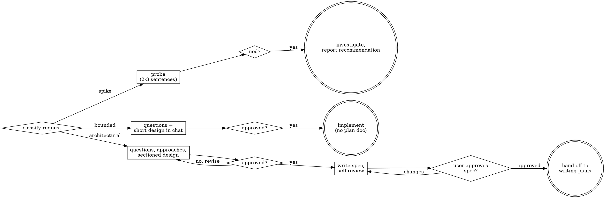

# Scoping before building

## Overview

An idea is not a design, and understanding what someone wants is not the same as having permission to build it. This skill turns a request into an approved shape through dialogue — questions, proposed approaches, a design presented for a yes — before any implementation begins. How much ceremony that takes scales with the size of the request. Whether a yes is required before code gets written does not: that gate is the same width for a one-line flag and for a new subsystem.

## When to use

- Before creating a feature, a new project, a component, or any functionality that doesn't exist yet.
- Before changing existing behavior in a way nobody present has actually signed off on.
- When a request's size is genuinely unclear — it could resolve to a one-file fix or a new subsystem, and you don't yet know which.
- When the direction sounds obvious but "yes, build it that way" was never actually said.
- Not for: turning an already-clear requirement into tasks (see `structuring-an-implementation-plan`).
- `reading-specifications` looks adjacent — it also turns something vague into something concrete. The difference is what's missing: `reading-specifications` starts from a spec that already exists and resolves its ambiguity by reading harder. This skill starts before anything is written down, when *what to build* is still open and settling it takes a conversation with a person, not another pass over a document. Run this skill first; whatever it produces is what `reading-specifications` would later read.

## Classify before asking anything

Say the classification out loud before your first question — "this looks bounded, so I'll present a short design here rather than write a spec" — so it can be corrected before you invest in the wrong amount of process.

| Path | What it looks like | What it produces |
|---|---|---|
| Spike | A feasibility question — "can this work," "is this even possible" — where the deliverable is an answer, not code anyone keeps | A recommendation; anything built along the way stays labeled throwaway |
| Bounded | A well-scoped change to a flow that already exists in the codebase you're working in — a new flag, a small endpoint, a one-file fix | A few sentences of design, said out loud in chat |
| Architectural | A new project, a new subsystem, or a change that restructures how components fit together or touches an interface other code relies on | A written, self-reviewed spec, handed off to `structuring-an-implementation-plan` |

Two traps live inside the classification itself. **Bounded measures the repo, not your familiarity** — recognizing "this is a CRUD app" is not the same as the change having an existing flow to modify; no existing flow means the task is architectural, no matter how standard the shape feels. **Torn between two paths, take the heavier one** — reaching for the lighter label to dodge a step is the doubt talking, not a real read of the task.

The classification only moves in one direction. If hidden complexity turns up mid-task — the "small fix" touches an interface three other things depend on — stop, say so, and move to the heavier path. Nothing downgrades mid-task, even when what's left looks trivial in hindsight.

## The gate that never shrinks

Every path ends the same way: the user approves the intent before any implementation happens — before a file, a scaffold, or a dependency install, on the spike path as much as the architectural one.

What scales with a task's simplicity is the size of the artifact you present: two sentences in chat for a small bounded change, a written spec for an architectural one. What never scales down is the requirement to stop and wait for an explicit answer. A todo list and a single-function utility both still need a spoken yes; they just need a shorter design first. Presenting a design and starting the implementation in the same breath skips the gate, even when the design itself was correct.

## Working the spike path

A spike skips everything below, down to the report. State the question and a cheap plan to probe it in two or three sentences, get a nod, then find out as cheaply as correctness allows. Whatever gets built to answer it stays labeled throwaway — keeping it is a new request, not a continuation, and needs its own classification.

## Understanding the idea

This step is shared by the bounded and architectural paths. Start by reading the project rather than asking about it — files, docs, and recent commits already answer questions you'd otherwise have to ask. Then, before refining any detail, check whether the request is actually several independent projects wearing one description: "a platform with chat, billing, and analytics" is three or four specs, not one. Decomposing that shape comes before any question about one piece's details — otherwise the questions polish a slice of something that needs splitting first. Brainstorm the first sub-project through the normal flow; each remaining piece gets its own pass later.

For a request that is genuinely one project: ask one question at a time, prefer multiple-choice over open-ended where you can, and never bundle a second question into the same message as the first — a message holding two questions reliably gets one answered. This holds for a live back-and-forth with someone present to answer, where each reply can change what's worth asking next; it's the opposite of `reading-specifications`' advice to batch questions, which applies specifically to asynchronous clarification against a spec or ticket author, where round-trip latency — not conversational flow — is the cost being minimized. Aim the questions at purpose, constraints, and success criteria; work out implementation detail yourself rather than asking about it.

## Working the bounded path

After understanding the idea, present the design directly in chat — a few sentences to a few short paragraphs covering the approach, the files it touches, and how it'll be tested — then stop. Once the user says yes, implement through the normal development workflow (`writing-the-failing-test-first` applies). No plan document exists on this path; the chat message you already got approved is the design.

## Exploring approaches (architectural path)

Propose two or three real approaches, not one dressed up as a choice. Lead with the one you'd actually pick and say why; present the others honestly enough that a different choice would be defensible. Apply YAGNI to all of them before presenting — an approach padded with unrequested features doesn't get more convincing for having more in it, and everything trimmed here is a paragraph the eventual spec won't have to carry either.

## When the design needs an answer code can give faster than guessing

Sometimes a question blocking the design itself — does this library support batch writes, does this API actually return the field an approach depends on — is faster to answer by running five lines than by reading documentation or guessing out loud. That's still research, not implementation, and it stays research only under three conditions: it answers one specific open question, nothing from it survives into the approved build, and you say what you're doing before you do it ("let me check whether X supports Y — throwaway, just answering the question"). The moment the answer to the question becomes "yes, and here's forty lines that basically already do it," the spike quietly became the build, and the approval it was supposed to inform never happened. Delete the probe once it's answered the question, the same way a spike's output is disposable, and bring the *answer* back into the design conversation, not the code.

## Presenting the design

Once the shape is clear, present it in sections and check after each one, rather than unloading the whole thing and asking for a single verdict at the end — a wrong assumption in section one invalidates everything built on it in section four, and catching it before section four is the entire point of the checkpoint. Scale each section's length to how much it actually needs: a couple of sentences where the choice is obvious, a longer paragraph where it's genuinely nuanced. Cover architecture, the components involved, how data moves between them, error handling, and how it gets tested. Expect to backtrack — a section that doesn't land is a reason to revisit an earlier one, not to push forward and hope it resolves itself.

Two judgment calls belong inside this step:

**Unit boundaries.** Break the design into pieces that each do one thing, talk to each other through a clear interface, and can be understood or tested without the rest of the system loaded into your head. For each one you should be able to say what it does, how something else calls it, and what it depends on, without reading its internals. If you can't change a piece's internals without breaking something that calls it, or can't tell what it does without reading how it does it, the boundary is in the wrong place. This pays off directly for you, too: a unit small enough to hold in context edits more reliably than one that isn't, and a file that's grown large is usually a unit that's grown two responsibilities.

**Fit with what's already there.** Read the existing structure before proposing new shape, and follow the patterns already in use rather than introducing a competing one. Where the existing code has a real problem the new work will make worse — a file that's outgrown itself, a boundary nothing respects — fold a targeted fix into the design, the way any developer improves the code they're already standing in. That's different from proposing cleanup nobody asked for on code the current work doesn't touch; leave that alone no matter how tempting it looks.

## When a picture is the answer

Some design questions are spatial — a layout, the shape of a state machine, two competing visual directions — and prose forces the other person to reconstruct in their head a picture you already hold clearly in yours. For those, sketch it: a small diagram, a rough box-and-arrow layout, a comparison table lined up side by side. For everything else — what a term means, which features are in scope, a tradeoff between two technical approaches — text says it directly and a sketch would just be decoration.

Judge this per question, not once for the whole conversation. A question that mentions a visual surface isn't automatically a visual question: "what should the settings page let someone configure" is a words question — the answer is a list. "Which of these two layouts reads better" is a pictures question — the answer is a shape. Decide which kind you're actually holding before deciding how to present it.

## Writing the spec

Once every section has been approved, write the whole design down. Put it wherever this project already keeps design docs — look for an existing `docs/`, `specs/`, or `design/` directory and follow the naming already in use there rather than introducing a second convention alongside it. Absent any existing convention, default to `specs/YYYY-MM-DD-<topic>-design.md` at the repo root. A stated user preference overrides both. Commit the spec once it's written.

## Spec self-review

Before asking anyone to read it, read the spec yourself, adversarially, and fix what you find rather than flagging it for later:

| Check | Look for |
|---|---|
| Completeness | "TBD," "TODO," a section that trails off, a requirement too vague to build from |
| Consistency | Two sections that quietly contradict each other, or an architecture description that doesn't match what the feature sections actually describe |
| Scope | Whether this is one implementation plan's worth of work, or secretly several specs that need separating first |
| Ambiguity | Any requirement a reasonable reader could take two different ways — if so, pick one reading and make the spec say it explicitly |

Calibrate what counts as an issue: something that would send an implementation plan in the wrong direction is worth fixing now. A section shorter than its neighbors, or a sentence that could be phrased more elegantly, is not — approve past those instead of manufacturing a second pass over wording. Fix what's actually wrong and move on; this loop doesn't need to repeat once the real issues are gone.

Then hand the written spec to the user with a direct ask — something like "spec's written and committed to `<path>`; let me know if you want changes before I turn it into an implementation plan" — and wait. Changes requested send you back through the self-review loop; approval sends you to `structuring-an-implementation-plan`, the only skill that follows brainstorming on this path. Nothing else does — not an implementation skill, not a scaffold, not a first commit of actual code.

## Common mistakes

| Symptom | Real cause |
|---|---|
| Implementation started right after the design was presented | The design and the approval were treated as one step; presenting is not the same event as hearing yes |
| A "simple" task shipped with no design conversation at all | Simplicity was applied to the approval instead of to the artifact; simple still gets a design, just a short one |
| A bounded task quietly turned into a rewrite mid-implementation | Complexity was absorbed instead of triggering a stop-and-reclassify |
| Five questions sent in one message, only the first one answered | Questions weren't batched one at a time |
| A written spec reads clean but the plan built from it goes sideways | Self-review checked spelling and section balance instead of contradictions and ambiguity |
| A layout question described in three paragraphs still gets misread | The question was visual; it got the text treatment anyway |
| Exploratory code from mid-design "just checking" ends up in the shipped implementation | Research and building were never actually kept separate — the probe's output should have crossed back in as an answer, not as code |

## Red flags

- "This is too small to need a design" — small changes the size of the design, never whether one happens.
- "It's obviously bounded, I'll start while they're still reading" — the gate is the wait for yes, not the design's length.
- "The spike answered the question, I might as well keep the code" — that's a new request; classify it on its own.
- "It grew a little, but I'm nearly done" — hidden complexity upgrades the path immediately, not once the task is finished.
- "They already approved the first version, so this revision doesn't need a new yes" — each version gets its own approval.
