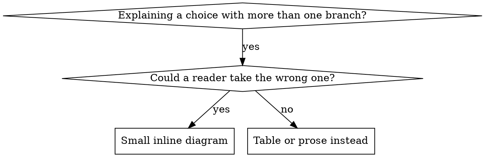

# Writing skills

## Overview

A skill is a judgment call, captured once so it doesn't get re-derived — worse, under pressure — every time it recurs. Writing one is closer to test-driven development than to documentation: the deliverable isn't a file that reads well to the person who wrote it, it's a file that measurably changes what a fresh agent does, one under no obligation to agree with you. If you haven't watched an agent get it wrong without the skill, you don't yet know whether the skill teaches the right thing or just the thing that felt right to write down.

## When to use

- Deciding whether a recurring technique, house convention, or hard-won judgment call is worth a skill at all — versus a one-off comment, an instruction in a project's own CLAUDE.md, or nothing.
- Drafting a new skill: naming it, writing its frontmatter, deciding what belongs inline versus in a reference file. (`naming-things` covers identifier judgment generally; this skill covers the narrower register a skill's own name and description need in order to trigger correctly.)
- An existing skill gets skipped, applied inconsistently, or visibly rationalized around under pressure — it needs editing, not a louder version of the same text.
- Moving a finished draft from a file in `skills/` to something actually live: cataloged, translated, gated, and on the deployed site.
- Not for: using an already-written skill to do the task in front of you — see `using-tbaguette`.

## Is this worth a skill

Write one when the technique wasn't obvious the first time you needed it, you'd reach for it again on a different codebase in a different language, and someone without your specific context would get it wrong without being told.

Don't write one when it's a single-project convention — that belongs in that project's own CLAUDE.md or README, not in a library that has to survive being read cold in a repo it has never seen — when it's standard practice already documented well elsewhere, or when it's mechanical enough to enforce with a linter or a script instead of a paragraph someone has to remember to read.

That first exclusion is stricter here than in general skill-authoring advice: every skill in this repo is project-, stack-, and language-agnostic by constitution, not by convention. A skill that only makes sense inside one specific codebase is a defect in this library, however well it reads.

| Shape | Answers | Example here |
|---|---|---|
| Technique | A concrete method, with steps | `atomic-commits` — how to split a tree that grew three changes |
| Pattern | A way of recognizing a situation and reasoning about it | `naming-things` — what a name should encode, in priority order |
| Reference | Judgment-dense material to consult, not a procedure to run | `formidable`'s stack files — which idioms a given surface expects |

Most skills are technique or pattern, and stay a single file. Reference-shaped content is the case most likely to outgrow one file — see Structure, below.

## Frontmatter and the description register

Exactly two fields, nothing else:

```yaml
---
name: skill-name-with-hyphens
description: Use when A, B, or C. Covers D, E, F.
---
```

`name` matches the skill's directory name exactly — hyphens only, no other punctuation — and it's the string that follows `TBaguette:` when a skill is invoked directly (`TBaguette:atomic-commits`).

`description` is the only signal an agent has to decide whether to open the file at all, competing against every other skill's metadata for the same attention. The register used throughout this repo's other skills: **"Use when A, B, or C. Covers D, E, F."** "Use when" is triggers — symptoms, situations, words someone would actually say or grep for ("flaky", "a bisect lands on", "the checkout is shared with another agent"). "Covers," where present, is topic keywords for search, not a summary of steps.

Those are different jobs, and swapping one for the other breaks discovery in a specific way: a description that summarizes the skill's process becomes a shortcut. An agent reads "reviews in two stages" in the description, does something that feels like two stages, and never opens the body where the real two stages — and the difference between them — actually live. Strip the summary back down to a trigger, and the same agent opens the file and follows the real steps, because the description gave it a reason to read instead of a reason to believe it already knew.

A few rules that hold throughout this repo:

- Third person, always — "Use when a diff mixes...", never "I can help you split...". It sits in a system prompt next to dozens of other third-person descriptions; a stray first person reads as a typo.
- Concrete symptoms beat abstract categories. "When a bisect lands on a commit too large to reason about" finds an agent mid-bisect; "for git hygiene" doesn't find anyone.
- Triggers stay technology-agnostic unless the skill itself is technology-specific. This repo's descriptions name problems — a race condition, an ambiguous spec, a name nobody can explain — not language-specific symptoms.
- No length ceremony. Some descriptions here are one clause; others, like `atomic-commits`', run several triggers deep. Long enough to name the real triggers, no longer.

See `reference/anthropic-best-practices.md` for the fuller, more general version of this guidance, including where this repo's actual naming habits diverge from the official recommendation.

## Structure: inline first, reference files rarely

Default to one file. The overwhelming majority of this repo's skills are a single `SKILL.md` with everything inline; only a handful out of dozens carry a `reference/` directory at all, and each one earns it the same way. `formidable` routes through twelve different UI stacks and needs a separate file per stack so an agent loads only the one it's actually using. `systematic-debugging` keeps three techniques out of line because a given bug needs at most one of them. That ratio — a handful, not a default — is what to calibrate against.

Split into `reference/*.md` when content is genuinely too large to want inline on every trigger, and — the part that's easy to miss — when it's something an agent needs *selectively* rather than *always*: API syntax nobody needs on every invocation, a stack-specific playbook that only applies to one of several possible targets, a worked example long enough to want on demand instead of by default. If every reader would need the content every time regardless of length, it belongs inline; splitting it then just adds a mandatory extra read with no selectivity payoff.

Where a reference file is warranted:

- Link every reference file directly from `SKILL.md`, so none of them is reachable *only* by passing through another one. An agent previewing a long file under time pressure will sometimes skim rather than read it whole, and a reference reachable only through another reference is one that skimming never reaches. Cross-links between two files that are each already linked from `SKILL.md` are fine — `systematic-debugging`'s reference files point at each other, and every one of them is still one hop from the skill.
- Give it a table of contents once it runs past roughly 100 lines, so a partial read still shows the full scope.
- Name it for its content (`stacks/web.md`), never for its position (`reference2.md`).

A small inline diagram earns its place at a genuine decision point only — and "should this be a diagram or a table" is exactly that kind of decision, which makes it its own example:



That's a fenced ` ```dot ` block sitting directly in the skill's own prose — not a script, and not a rendering pipeline. `brainstorming` uses the identical technique for its own request-classification flow. Nothing needs to render it; the point is that the shape of the decision is readable straight off the text, by an agent or by a human skimming the raw file. Reach for one only for a genuine fork with a genuine wrong branch — never for a linear sequence (a numbered list reads faster), reference material (a table), or code (a fenced block in the actual language). A diagram whose boxes contain code, or whose labels read `step1`/`step2`, is doing a list's job worse than a list would.

## Writing guidance that actually changes behavior

Two different baseline failures call for two different shapes of guidance, and reaching for the wrong one measurably backfires:

| Baseline failure | Write | Not |
|---|---|---|
| Agent knows the rule and skips it under pressure — a deadline, sunk cost, "just this once" | A flat prohibition, closed against the specific rationalizations already seen in testing | Soft language: "prefer," "consider," "try to" |
| Agent complies, but the output has the wrong shape — bloated, buried conclusion, restates the input back | A positive recipe: state what the output *is*, its parts, in order | A list of don'ts — under a competing incentive, "don't restate the input" gets negotiated with instead of obeyed |
| Agent omits a required piece of something it already produces | A required field or slot inside the template it's already filling in | A prose reminder floating near the template |
| Behavior should change depending on a condition | A conditional keyed to something observable ("if X is present, do Y") | An unconditional rule plus a list of exceptions |

One rule holds regardless of row: no nuance clauses. "Don't do X unless it really matters" reopens the exact negotiation a flat rule was supposed to close. A genuine exception gets written as its own conditional, keyed to something checkable — not as a softener bolted onto a rule that was otherwise working.

The first row is where compelling language matters most, and where it's most often underpowered. "Consider writing the test first" reads as optional, and optional is precisely what a deadline overrides. `reference/persuasion-principles.md` has the fuller treatment — which persuasion principles measurably move an LLM's compliance, and which skill types should and shouldn't reach for them. Short version: authority and commitment language ("no exceptions," a named rationalization closed off by name) belongs in a discipline-enforcing skill, like `using-tbaguette`'s own opening notice, and does not belong in a reference skill, where it just makes accurate material sound like it's trying to sell something.

## Testing before it ships

The core loop mirrors `test-driven-development`, aimed at a paragraph instead of a function: watch the failure, write the minimal fix, close the gap, repeat.

1. **RED.** Before writing the skill, run the realistic, pressured version of the task on a fresh subagent that has never seen it — no skill available yet. Watch what it actually does, and write down its exact rationalization, verbatim, not a summary of it.
2. **GREEN.** Write the skill to address that specific failure — not every failure imaginable, the one actually watched. Run the same scenario again, skill available. It should now comply.
3. **REFACTOR.** It won't be bulletproof on the first pass. When a fresh subagent finds a new rationalization, that's a real gap in the text, not a fluke in the subagent — close it explicitly and re-run.

A skill nobody has watched fail is a skill being guessed at. This matters most for anything discipline-enforcing — a rule someone is incentivized to skip — and least for pure reference material, like a syntax table, where there's no rule to rationalize around and so nothing pressure-testing would reveal. Editing an existing skill goes through the identical loop; "I'm just adding a section" isn't an exemption, because the section being added is exactly as untested as a new file until it's actually run.

`reference/testing-skills-with-subagents.md` has the full protocol: how to write a scenario with real teeth (concrete options, real constraints, no easy out that avoids actually choosing), the pressure types worth combining, and a worked example of bulletproofing a skill across several rounds.

## From draft to shipped

Writing the file is maybe a third of the job. In this repo specifically, committed and shipped are different states, and the gap between them is mechanical rather than creative:

- **A `CATALOG.md` row.** Find the matching category's table — the file is organized by the same categories as `skills/` itself — and add one row: the skill name and a phrase-length description in the existing terse register. No dagger (†): that mark means "hands off to a skill outside this repo," which a new TBaguette-native skill, by definition, isn't.
- **A skill count.** `CATALOG.md`'s own header states the total; `scripts/generate.py` enforces the same number separately as `EXPECTED_SKILL_COUNT`, and the build fails if the two disagree.
- **Translation.** The site ships in every locale `scripts/locales.py` lists; a new skill's description needs an entry in each.
- **A quality gate.** `karen-and-the-manager` is this repo's standard pre-ship adversarial pass. A normal review having already come back clean is exactly when it's most warranted, not a reason to skip it.
- **A green test suite and a regenerated site.** `python3 scripts/run_tests.py`, then `python3 scripts/generate.py`.

None of that mechanism is this skill's job to re-explain in full. The pipeline itself — every step in order, including how to verify the deploy actually went live — lives in `tending-tbaguette`, which is a local-only skill under `~/.claude/skills/` rather than part of this plugin, so don't expect to invoke it as `TBaguette:tending-tbaguette`. Without it, `CATALOG.md` and `scripts/generate.py` are the authorities on what a shipped skill has to satisfy. This skill's job ends at producing a draft worth running through it.

## Common mistakes

| Symptom | Real cause |
|---|---|
| Description reads like a changelog entry ("dispatches per task with review between") | Description written to summarize the skill instead of to trigger it; agents will follow the summary and skip the body |
| A `reference/` file for a forty-line skill | Reached for progressive disclosure before checking whether it fits inline; a handful of skills out of dozens have one, each because its content is genuinely read selectively |
| Skill ships without ever running on a subagent that didn't have it | RED phase skipped — the skill addresses whatever you imagined agents would do, not what they actually do |
| Every rule has an escape clause ("...unless it doesn't make sense") | A nuance clause reopens the exact negotiation a flat rule was meant to close |
| Skill written for a project-specific convention | Belongs in that project's own CLAUDE.md, not a library that has to survive being read cold in an unrelated repo |
| A flowchart shows a linear checklist | A numbered list would read faster; the diagram is doing a list's job worse |
| New skill has no `CATALOG.md` row | Written, not shipped — the count check in `scripts/generate.py` will fail the build the moment someone notices |

## Red flags

- "It's obviously clear, it doesn't need testing on a subagent."
- "I'll just add this section — it's small enough to skip re-testing."
- "This is basically the Anthropic or superpowers version, I don't need to check how this repo actually does it."
- "The description is a good summary of what the skill does" — a good summary and a good trigger are different documents.
- Reaching for a `reference/` file because the main one "feels long," without checking whether anything in it actually needs to be read selectively rather than every time.
